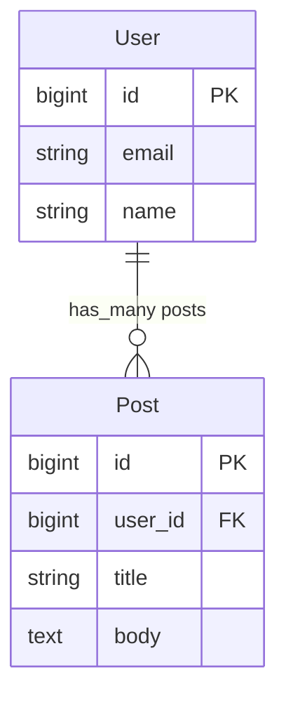
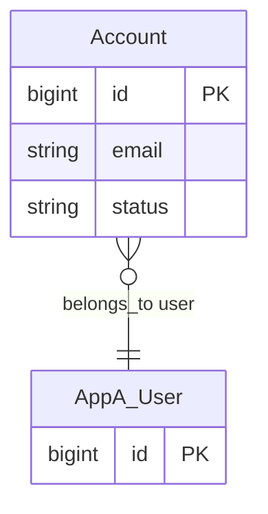

# ERD Generator

プロジェクト内の Rails スキーマとモデルファイルを解析し、Mermaid 形式の ER 図を生成する。

## 全体フロー

1. サブプロジェクト（Rails アプリ）を探索する
2. カラム表示レベルをユーザーに確認する
3. schema.rb を読み込み、テーブル定義を取得する
4. モデルファイルを読み込み、関連（has_many, belongs_to 等）を取得する
5. Mermaid erDiagram を生成する
6. ファイルに保存し、ユーザーに提示する

## Step 1: サブプロジェクトの探索

以下のパターンでプロジェクト内を検索する:

- `*/db/schema.rb` または `*/db/*_schema.rb`（複数DB構成の場合）
- `*/app/models/` ディレクトリ

サブプロジェクトが複数ある場合、**1枚の Markdown** に **サブプロジェクトごとに別々の Mermaid コードブロック** を出力する。

検出結果をユーザーに報告する。

## Step 2: カラム表示レベルの確認

図の詳細度についてユーザーに確認する。以下の3段階:

1. **PK/FK のみ**: id と外部キー（`*_id`）のみ表示。関連の概要把握向け
2. **主要カラム**: PK/FK + 重要なカラム（name, email, status, type 等）を表示。バランス型
3. **全カラム**: schema.rb の全カラムを表示。詳細な設計確認向け

ユーザーの選択に応じて出力を調整する。

## Step 3: schema.rb の解析

schema.rb（または `*_schema.rb`）を読み込み、以下を抽出する:

- テーブル名
- カラム名、型（string, integer, boolean 等）
- 外部キー（`*_id` カラムおよび `add_foreign_key` 制約）
- インデックス（ユニーク制約の把握用）

### 複数DB構成の場合

Rails の `connects_to` で複数DBに接続するプロジェクトでは、各DBのスキーマファイルを個別に読む。モデルファイルの継承元から接続先DBを判定する。

## Step 4: モデルファイルの解析

`app/models/` 配下のモデルファイルを読み込み、以下を抽出する:

### 抽出対象

- **継承元**: 基底クラスの種類から接続先DBを分類
- **関連**: `has_many`, `belongs_to`, `has_one`, `has_and_belongs_to_many`
- **through 関連**: `has_many :X, through: :Y`
- **ポリモーフィック**: `belongs_to :X, polymorphic: true`

### 対象外

- Read Model（DBテーブルを持たないクラス。`self.table_name` がないPOROや `include ActiveModel::Model` のみのクラス）
- Concern（`app/models/concerns/`）
- 抽象基底クラス（`self.abstract_class = true`）

### 外部gem由来のモデル

プロジェクト内にラッパーモデル（例: `MyModel < ExternalGem::Model`）がある場合:
- ラッパーモデルの名前でノードを作成する
- 接続先DBのセクションに配置する
- ラッパーに定義された関連のみ図に含める（gem側の全関連は不要）

## Step 5: Mermaid erDiagram の生成

### 図の構成方針

1. **`erDiagram` を使用**
2. **サブプロジェクトごとに別々の Mermaid コードブロック** を出力する（1枚のMarkdownに複数の `erDiagram`）
3. **各 erDiagram 内では DB 接続先ごとにコメントでセクション分け**
4. **テーブルはモデル名（クラス名）で表記** — 実テーブル名はコメントで補足
5. **関連は Mermaid の ER 記法で表現**
6. **別サブプロジェクトのモデルを参照する場合**: 参照先モデルをプレフィックス付き（例: `AppA_User`）で同じ図に含め、関連を表現する。図を分けない

### 関連の記法

| Rails | Mermaid | 意味 |
|---|---|---|
| `has_many` | `\|\|--o{` | 1対多 |
| `belongs_to` | `}o--\|\|` | 多対1 |
| `has_one` | `\|\|--\|\|` | 1対1 |
| `has_many through` | `}o--o{` | 多対多（中間テーブル経由） |

### カラムの型表記

schema.rb の型を以下に変換:

| schema.rb | erDiagram |
|---|---|
| `t.string` | `string` |
| `t.integer` | `integer` |
| `t.bigint` | `bigint` |
| `t.boolean` | `boolean` |
| `t.text` | `text` |
| `t.datetime` | `datetime` |
| `t.date` | `date` |
| `t.uuid` | `uuid` |
| `t.jsonb` / `t.json` | `jsonb` |
| `t.references` / `t.belongs_to` | `bigint` + FK マーク |

### カラムのマーク

- `PK` — 主キー（id）
- `FK` — 外部キー（`*_id` カラム）

### テンプレート

サブプロジェクトが2つある場合の出力例:

#### app_a



#### app_b



### 同一サブプロジェクト内の複数DB

1つのサブプロジェクトが複数DBに接続する場合（`connects_to` 等）、**DB接続先ごとにプレフィックス** を付けてテーブルの所属を明示する。メインDB（そのサブプロジェクト自身のDB）はプレフィックスなし、外部DBや参照専用DBにはプレフィックスを付ける。

### クロスプロジェクト参照

別サブプロジェクトのモデルを参照する関連がある場合:
- 参照先モデルを **プレフィックス付き**（例: `AppA_User`）で同じ erDiagram 内に含める
- カラムは PK のみの簡易表示で十分（詳細は参照元の図を見ればよい）
- コメントでどのサブプロジェクトのモデルかを明示する

### 名前衝突の回避

同一 erDiagram 内で複数サブプロジェクトのモデルが登場する場合、プレフィックスで区別する:

- `AppA_User` / `AppB_User`

## Step 6: 出力

生成した Mermaid 図を **必ずファイルに保存** し、コードブロックでもユーザーに提示する。

### ファイル保存（必須）

以下のパスに Markdown ファイルとして保存する:

```
~/docs/<project_name>/erd/<project_name>_erd_<日付>.md
```

- `<project_name>`: プロジェクトのルートディレクトリ名
- `<日付>`: `YYYY-MM-DD` 形式

例:
- `~/docs/myapp/erd/myapp_erd_2026-03-13.md`

ディレクトリが存在しない場合は作成する。

### ファイルの内容構成

各ファイルには以下を含める:

- **タイトル**: 何の図か（例: `# OCA ER図`）
- **スコープ**: 含まれるサブプロジェクトとDB
- **カラム表示レベル**: 選択されたレベル
- **生成日**: 日付
- **Mermaid 図**: コードブロック
- **補足**:
  - 各セクションのDB接続先
  - 外部DB のモデルが Read Only の場合はその旨
  - Read Model 等、図に含めなかったモデルの一覧と理由

### ユーザーへの提示

ファイル保存後、会話内でも Mermaid 図をコードブロックで提示し、保存先パスを案内する。

## 制約と注意

- **このスキルは汎用スキルである。** 特定プロジェクト固有の情報（プロジェクト名、クラス名、DB名、サービス名等）をスキル本文やテンプレートに含めてはならない。テンプレートには汎用的な例（User, Post, Account 等）のみ使用すること
- schema.rb とモデルファイルの内容を正確に反映する。推測で関連やカラムを追加しない
- 秘密情報（パスワード、APIキー等）は図に含めない
- Mermaid のエンティティ名にハイフン `-` を使わない（構文エラー）。アンダースコア `_` やキャメルケースを使う
- `erDiagram` ディレクティブを使用する
- テーブル数が多い場合（20以上）、ユーザーにグルーピングや省略の方針を確認する
- 抽象基底クラス（`ApplicationRecord`, `CommonRecord` 等）はエンティティとして図に含めない
