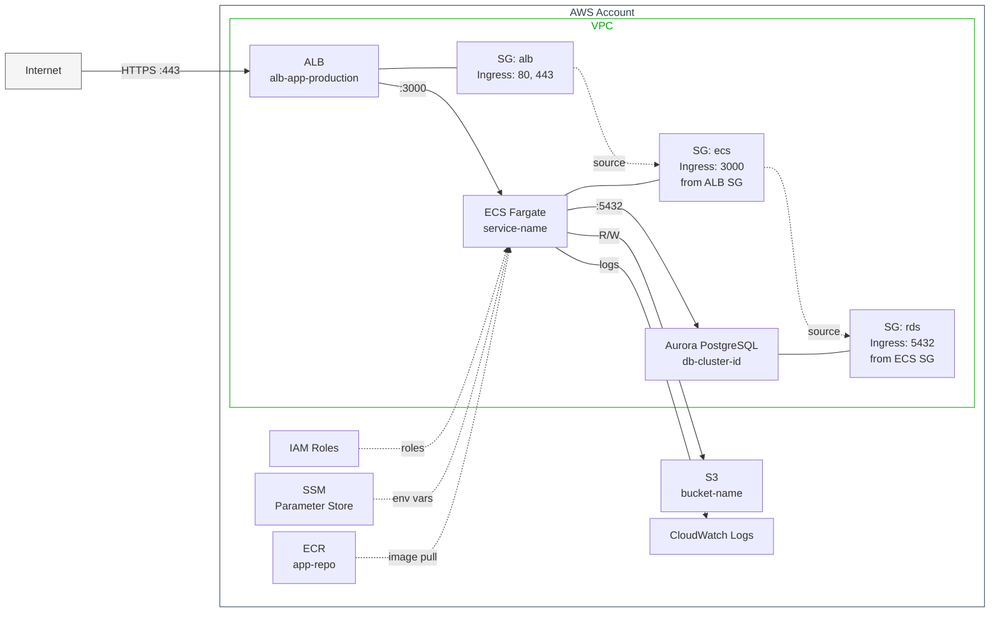
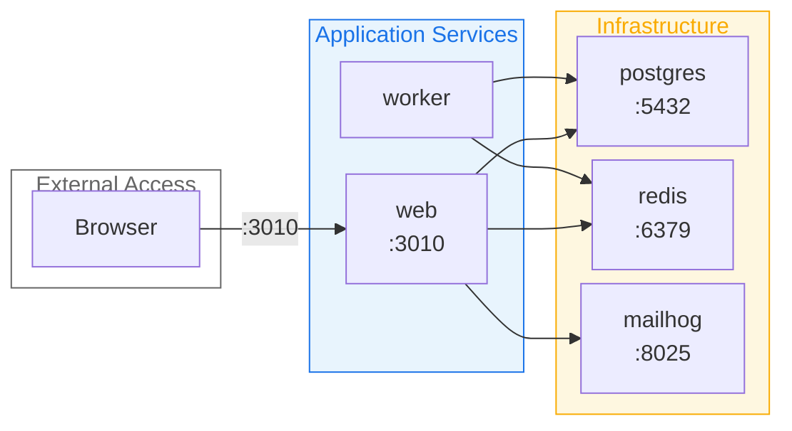
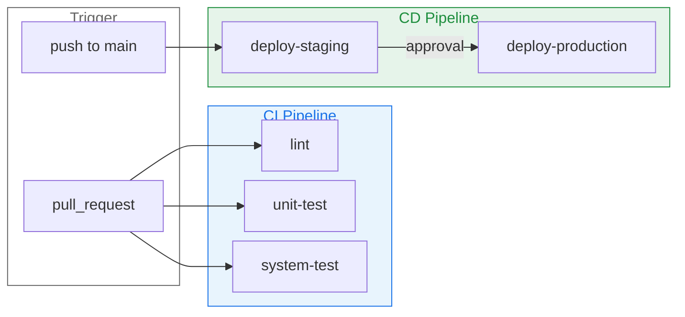

# IaC Diagram Generator

プロジェクト内の IaC ファイルを解析し、種別ごとに Mermaid 形式のインフラ構成図を生成する。

## 全体フロー

1. プロジェクト内の IaC ファイルを探索する
2. 検出された IaC の種別を報告し、どの図を生成するかユーザーに確認する
3. 種別ごとに IaC ファイルを読み込み、Mermaid 図を生成する
4. ファイルに保存し、ユーザーに提示する

## Step 1: IaC ファイルの探索

以下のパターンでプロジェクト内を検索する。

### Terraform
- `**/*.tf` ファイルを検索
- `modules/` ディレクトリ構造を把握する
- `env/` や `environments/` ディレクトリで環境分割を確認する

### Docker Compose
- `compose.yml`, `docker-compose.yml`, `docker-compose.*.yml`, `compose/*.yml` を検索

### GitHub Actions
- `.github/workflows/*.yml` を検索

検出結果をユーザーに報告し、生成対象を確認する。

## Step 2: 図の生成

### 共通の Mermaid スタイルガイド

全種別に共通する Mermaid の記述ルール。見やすく実用的な図を生成するための基本方針。

#### 間隔設定

デフォルトでは間隔が大きく図が縮小してしまうため、`init` ディレクティブで調整する:

```
%%{init: {'flowchart': {'nodeSpacing': 10, 'rankSpacing': 30}}}%%
```

#### スタイル定義

AWS リソースの視覚的なグルーピングには `style` と `classDef` を使用する:

```
%% AWS 全体グループ: 白背景 + 濃紺枠
style aws fill:#fff,color:#345,stroke:#345

%% VPC グループ: 白背景 + 緑枠
style vpc fill:#fff,color:#0a0,stroke:#0a0

%% 非表示グループ（レイアウト制御用）: 透明
classDef hidden fill:none,stroke:none,color:transparent
```

#### 接続線の長さ制御

`-` の個数で接続線の長さを制御する。外部→ALB は長め（`----->`）、内部接続は短め（`-->`）にしてラベルの重なりを防ぐ。

#### 非表示グループによるレイアウト制御

レイアウトを制御したい場合、タイトルを `[" "]` にしたサブグラフを使う:

```
subgraph hidden_group[" "]
    nodeA
    nodeB
end
class hidden_group hidden
```

非表示の接続線 `~~~` で層同士を繋ぎ、配置を制御できる。

---

### Terraform → AWS インフラ構成図

Terraform ファイルを読み込み、以下を抽出する:

**抽出対象:**
- `resource` ブロック: リソースタイプと名前
- `module` ブロック: モジュール間の依存
- `data` ブロック: 外部データ参照
- `variable` / `output`: モジュール間のデータフロー
- リソース間の参照（`aws_ecs_service` → `aws_ecs_task_definition` 等）

**図の構成方針:**

1. **`flowchart LR`（左から右）を使用** — 外部から内部への流れを左→右で表現
2. **AWS 全体をサブグラフで囲む** — `style aws fill:#fff,color:#345,stroke:#345`
3. **VPC をネストしたサブグラフで表現** — `style vpc fill:#fff,color:#0a0,stroke:#0a0`
4. **VPC 内を層で分割** — 前段（ALB）/ 中段（ECS）/ 後段（RDS）を非表示グループで配置制御
5. **VPC 外リソースを分離** — S3, ECR, CloudWatch, IAM, SSM 等は VPC 外に配置
6. **ノード ID にリソース識別子を使用** — ELB は DNSName、ECS は ClusterName/ServiceName、RDS は DBClusterIdentifier 等

**Mermaid 図テンプレート:**



**注意事項:**
- 上記はテンプレート。実際の tf ファイルの内容に基づいてノードとリソース名を置き換えること
- 環境（staging/production）ごとに差分がある場合は、共通構成を1つの図にし、差分を補足に記載
- リソース数が多い場合は主要なリソースに絞り、補足説明を添える
- `click` ディレクティブで AWS Console リンクを付与できる（テンプレートは下記参照）

**AWS Console リンク（オプション）:**

ノードにクリックリンクを付与して AWS Console に遷移可能にする:

```
click ecs href "https://ap-northeast-1.console.aws.amazon.com/ecs/v2/clusters/CLUSTER/services/SERVICE/health?region=ap-northeast-1" _blank
click rds href "https://ap-northeast-1.console.aws.amazon.com/rds/home?region=ap-northeast-1#database:id=CLUSTER-ID;is-cluster=true" _blank
click s3 href "https://s3.console.aws.amazon.com/s3/buckets/BUCKET-NAME?region=ap-northeast-1" _blank
```

リソース名が判明している場合のみ付与する。URL を推測しない。

---

### Docker Compose → サービス構成図

Docker Compose ファイルを読み込み、以下を抽出する:

**抽出対象:**
- `services`: サービス名、イメージ、ポートマッピング
- `depends_on`: サービス間の依存関係
- `networks`: ネットワーク定義と所属
- `volumes`: 共有ボリューム
- `ports`: 公開ポート
- `environment` / `env_file`: 環境変数（接続先の特定に使用）

**図の構成方針:**
1. **`flowchart LR`（左から右）を使用**
2. **外部アクセス / アプリケーション / インフラをサブグラフで分離**
3. **ポート番号をラベルに記載**
4. **間隔設定を適用**
5. **サブグラフにスタイル適用** — アプリとインフラで色分け

**Mermaid 図テンプレート:**


**注意事項:**
- 複数の Compose ファイルがある場合、ベースファイルとオーバーライドの関係を考慮する
- ラッパースクリプトがあれば、どのファイルが組み合わされるか確認する

---

### GitHub Actions → CI/CD ワークフロー図

GitHub Actions ワークフローファイルを読み込み、以下を抽出する:

**抽出対象:**
- `on`: トリガー条件（push, pull_request, workflow_dispatch 等）
- `jobs`: ジョブ定義
- `needs`: ジョブ間の依存関係
- `uses`: 再利用ワークフロー（`_*.yml`）の呼び出し
- `if`: 条件分岐
- 主要な `steps`（デプロイ、テスト等の重要ステップ）

**図の構成方針:**
1. **`flowchart LR`（左から右）を使用** — トリガー → CI → CD の流れ
2. **トリガーを起点ノードにする**
3. **CI / CD をサブグラフで分離**
4. **`needs` による依存を矢印で表現**
5. **条件分岐はラベルで明示**
6. **再利用ワークフローはサブグラフで表現**
7. **サブグラフにスタイル適用** — CI は青系、CD は緑系

**Mermaid 図テンプレート:**


**注意事項:**
- ワークフロー数が多い場合、関連するワークフローをグループ化する
- 再利用ワークフロー（`workflow_call`）は呼び出し元との関係を示す
- 全ワークフローを1つの図にまとめると複雑になる場合、プロジェクト単位で分割する

---

## Step 3: 出力

生成した Mermaid 図を **必ずファイルに保存** し、コードブロックでもユーザーに提示する。

### ファイル保存（必須）

以下のパスに Markdown ファイルとして保存する:

```
~/docs/<project_name>/iac-diagrams/<sub_project>_<種別>_<日付>.md
```

- `<project_name>`: プロジェクトのルートディレクトリ名
- `<sub_project>`: サブプロジェクト名やスコープ
- `<種別>`: `terraform`, `docker-compose`, `github-actions`
- `<日付>`: `YYYY-MM-DD` 形式

例:
- `~/docs/myapp/iac-diagrams/myapp_terraform_2026-03-13.md`
- `~/docs/myapp/iac-diagrams/myapp_docker-compose_2026-03-13.md`

ディレクトリが存在しない場合は作成する。

### ファイルの内容構成

各ファイルには以下を含める:
- **タイトル**: 何の図か（例: `# Terraform インフラ構成図`）
- **スコープ**: 対象の環境やプロジェクト
- **生成日**: 日付
- **Mermaid 図**: コードブロック
- **補足**: 図に含めきれなかった情報や注意事項（環境差分など）

### ユーザーへの提示

ファイル保存後、会話内でも Mermaid 図をコードブロックで提示し、保存先パスを案内する。

## 制約と注意

- **このスキルは汎用スキルである。** 特定プロジェクト固有の情報（プロジェクト名、サービス名、リソース名等）をスキル本文やテンプレートに含めてはならない。テンプレートには汎用的な例のみ使用すること
- IaC ファイルの内容を正確に反映する。推測でリソースを追加しない
- 秘密情報（パスワード、APIキー等）は図に含めない
- Mermaid のノード ID にハイフン `-` を使わない（構文エラー）。アンダースコア `_` やキャメルケースを使う
- サブグラフ名に日本語を使う場合は引用符で囲む
- `flowchart` ディレクティブを使用する（`graph` ではなく）。`flowchart` は `graph` の上位互換で、サブグラフのネストやスタイル指定がより柔軟
- `@{ img: ... }` アイコン記法は Mermaid v11.3+ が必要。互換性を重視する場合は標準の `["label"]` ノードを使用する
- init ディレクティブは `%%{init: {...}}%%` 形式を使用する（YAML frontmatter `---` 形式は一部ビューアーで非対応）
- 改行は `\n` ではなく `<br/>` を使用する。VS Code 拡張（bierner.markdown-mermaid）等では `\n` が改行として解釈されない
- 点線 `-.->` は使わない。線もラベルも薄く表示されて見えにくい。代わりに実線 `-->` を使い、メインフローは太線 `==>` で区別する
- `theme: 'base'` を init に設定しない。VS Code 拡張等で副作用を起こし、線やラベルが薄くなる原因になる
